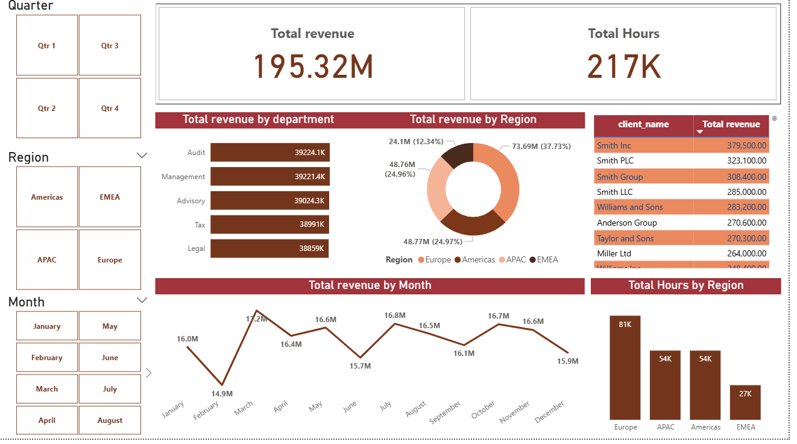
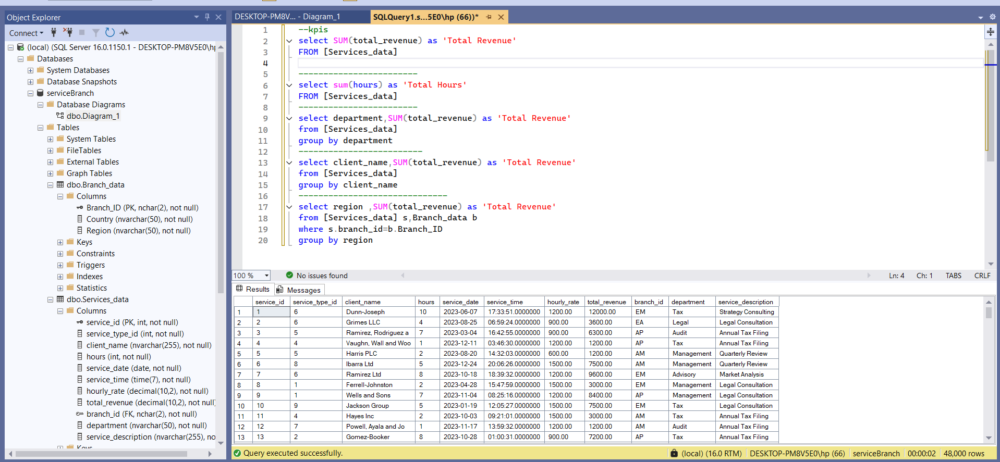

# 📊 Service Branch Dashboard – Power BI Data Analysis Project

This project presents a **Service Branch Dashboard** built in **Microsoft Power BI**, connected to a **SQL Server** database.  
It visualizes key performance metrics and business trends for a company providing hourly professional services across multiple regions.

The dashboard delivers interactive insights into **Total Revenue**, **Total Hours Worked**, and detailed breakdowns by **Department**, **Client**, **Region**, and **Month**.  
Using SQL queries for data aggregation and Power BI visuals such as bar charts, donut charts, and line graphs, raw data was transformed into meaningful business insights.

---
## 🖥️ Dashboard Preview

### **Dashboard**

### **sql-Database**

------------------
## ✨ Project Structure & Key Analysis

The dashboard is structured into several analytical sections focusing on performance, client contribution, and regional analysis.

### 1. Performance Overview
- **Total Revenue:** 195.32M  
- **Total Hours:** 217K  
- **Top Regions:**
  - **Europe:** Highest total hours (81K)
  - **Americas:** Highest total revenue (73.69M)
- **Top Departments:** Audit and Management  
- **Top Client:** Smith Inc  
- **Peak Months:** March and July showed the highest performance in revenue trends  

### 2. Drill-Down Analysis
- Department-wise revenue and hours  
- Regional contribution to total hours  
- Client-based performance breakdown  

---

## 💡 Business Insights & Recommendations

- **Expand Operations in the Americas:** Strong financial results suggest scaling services or marketing efforts there.  
- **Optimize Workforce in Europe:** High total hours indicate potential efficiency improvements.  
- **Strengthen Client Relations:** Focus on high-performing clients such as **Smith Inc** and **Smith PLC** for long-term contracts.  
- **Leverage Best Practices:** Use Audit and Management departments’ success as internal training benchmarks.  
- **Investigate Underperformance:** Analyze EMEA region challenges like low demand or pricing strategy misalignment.  

---

## 🧠 Skills & Tools Demonstrated

- **SQL Server:** Data Modeling, KPI Calculation, and Query Optimization  
- **Power BI:** Data Visualization, DAX Measures, and Interactive Dashboards  
- **Business Analysis:** Performance Evaluation, Trend Analysis, and Strategic Recommendations  

---

## 🧰 Tools Used

- Microsoft SQL Server  
- Microsoft Power BI Desktop  

